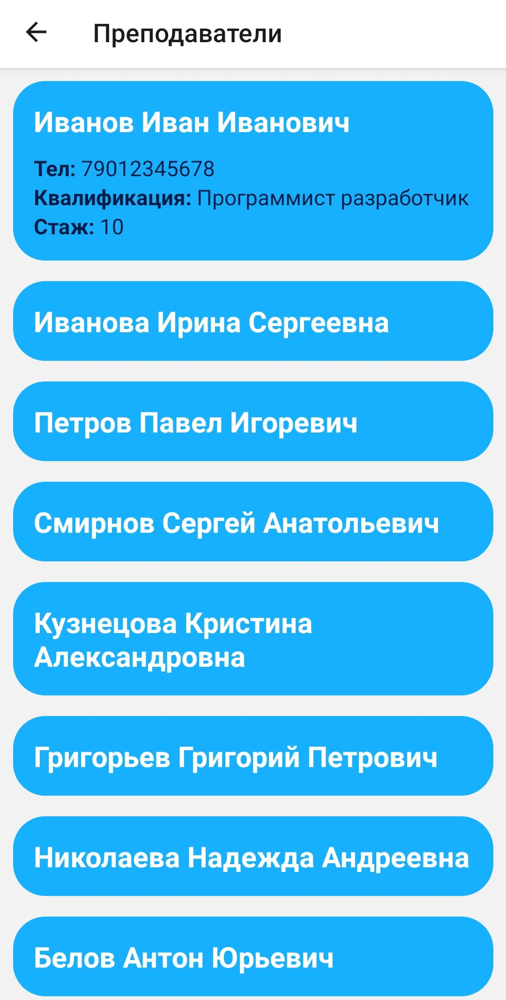

# DirectDost
 

### React native (Expo) / University reference mobile application.

---

## Installation
### For the application to work, the following steps must be performed:
### 1. Go to the initdb folder and edit connectionConfig.json to include information for connecting to the postgres database.
### 2. Install the modules by running the `npm install` command.
### 3. Run the index.js file to create tables in the `node index.js` database.
### 4. Go to the client folder and also install the modules by running the `npm install` command.
### 5. Go to the server folder along the path: server/src/database/connection.ts and edit the file to include information for connecting to the postgres database.
### 6. Server folder, install the modules with the `npm install` command.

 

## Npm start
### To run the application, follow these steps:
### 1. Start the server by running the `npm start` command in the server folder and then in the client folder.
### 2. Open the ExpoGo app and scan the qrcode.
### The application will then be ready to use.

 

## Authors
### Eugene Viktorov - e.viktorovvv@yandex.com / Frontend
### Smakovsky Ilya - rc.cun@mail.ru / Backend

 

# Application screenshots
 
 
 
 
 
 
 